<!-- EDIT: INTRO -->

### Backend Developer · Systems Builder

Engineering deterministic, fault-tolerant distributed backend systems and scalable APIs.

<!-- END EDIT -->

 

  

## Featured Project

  

  

## Tech Stack

<!-- EDIT: STACK -->

### Backend & Infrastructure

  

### Cloud & DevOps

  

### Tools & Versioning

  

<!-- END EDIT -->

 

## Technical Interests

<!-- EDIT: AI INTERESTS -->

<table>
<tr>

<td width="33%" valign="top">

<strong>Systems</strong>

Distributed Systems  
Fault-Tolerant Design

</td>

<td width="33%" valign="top">

<strong>Architecture</strong>

Scalable APIs  
Deterministic Data Flows

</td>

<td width="33%" valign="top">

<strong>Infrastructure</strong>

Cloud Native Architecture  
Performance Optimization

</td>

</tr>
</table>

<!-- END EDIT -->

 

## Background

<!-- EDIT: BACKGROUND -->

**Backend Developer** focused on engineering robust and scalable infrastructure.

Interested in:

`Distributed Systems` · `System Design` · `API Lifecycle Management` · `Database Architecture` · `CI/CD Pipelines`

<!-- END EDIT -->

 

  

 

## Connect

<!-- EDIT: CONNECT -->

 

Engineering reliability, one system at a time.

<!-- END EDIT -->
